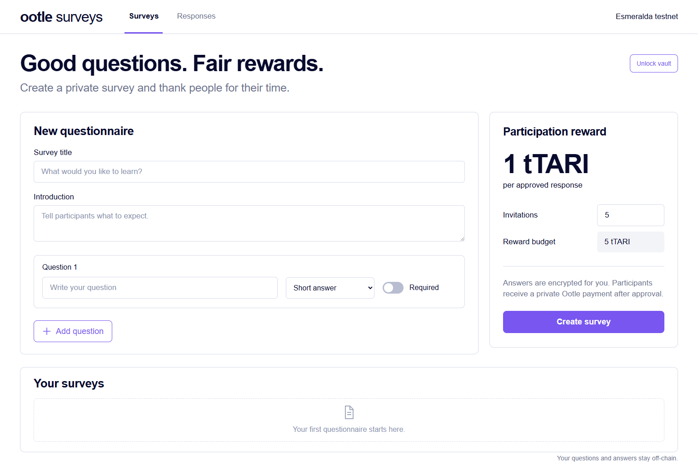

# Ootle Surveys

A self-hosted prototype for encrypted questionnaires and participation rewards
on Tari Ootle's Esmeralda testnet. MIT licensed.

Create a questionnaire, share individual invitations, receive browser-encrypted
responses, and approve a private 1 tTARI reward for each participant. The Ootle
template enforces the reward budget, authorized payouts, one-use payment receipts,
and the pool's closing epoch. Questions and answers stay off-chain.



**Status:** working local prototype with real testnet payment verification.
There is no hosted public survey service, mainnet support, or independent security audit.

## Implemented

- `contract/src/lib.rs`: funded reward pool, authorized distribution to a single
  stealth recipient per reward, anti-replay receipts, enforced closing epoch,
  and sponsor-only return of unused funds. No upgrade or early-withdrawal method.
- `contract/tests/rewards.rs`: actual Ootle engine tests with generated stealth
  proofs, including unauthorized/public/duplicate payouts and expiry boundaries.
- `lib/envelopes.mjs`: browser-compatible RSA-OAEP-3072/SHA-256 and AES-256-GCM
  response envelopes. Random response contexts are authenticated in both layers.
- `tests/envelopes.test.mjs`: wrong-key, ciphertext/key/nonce tampering, cross-context
  substitution, randomized encryption, payload bounds, and independent receipt tests.

- Browser questionnaire builder: short/long text, multiple choice, ratings, required
  questions, individual invitation links, encrypted submission, and response review.
- Password-encrypted organizer vault with key backup. Passwords never reach the server.
- Authenticated organizer API, one-use invitation handling, encrypted SQLite storage,
  origin/host allowlists, and private payment integration.
- Published template and funded pool. Two real 1 tTARI test payouts verified, including
  the complete browser flow and recipient-side decryption.

## Open the local app

The application runs at **http://127.0.0.1:4182**. Enter the organizer access code
generated in `data/admin-access.txt` on first startup.
Choose your own vault password (12+ characters), then use **Back up vault**.
There is no password-reset backdoor.

Start on Windows from the project directory:

```powershell
.\scripts\start.ps1
```

Fresh checkout, Node 24+:

```sh
npm ci
npm run setup:testnet
npm run build
npm start
```

The app creates up to 20 individual invitation links per survey and reserves one
1 tTARI reward per invitation. Share a different link per person. Participants
use an Esmeralda Ootle receiving address; the app never asks for their seed phrase.
Review participation under **Responses**, then approve the reward.

The reference reward pool started with 100 tTARI; two were used for live
validation. Its closing epoch is recorded in `artifacts/deployment.json`.
Those published addresses are evidence, not an operator wallet for new installs.
`npm run setup:testnet` creates your own operator wallet, publishes the bundled
WASM, and funds a new pool using testnet faucet tokens. To use a newly compiled
artifact, pass its path: `npm run setup:testnet -- path/to/private_rewards.wasm`.
Setup saves returned operation IDs so pending steps can be reconciled. An unknown
submission outcome still requires investigation before repeating an operation.
Testnet resets can invalidate deployments.

The current instance is **local only**. Invitation links work on this computer.
External participants need an HTTPS deployment. Set `SURVEY_PUBLIC_ORIGIN` to the
exact external origin and place the loopback service behind an HTTPS reverse proxy.
Public deployment, email delivery, multiple organizers, and mainnet use are not included.

`data/` is private and excluded from Git. It contains the operator's test-wallet
keys, organizer access code, encrypted vault, database, and deployment settings.
Keep secure backups. Stop the server before copying SQLite, or use its online
backup API: copying the database without its WAL can lose recent records. A vault
key backup alone does not contain questionnaire or response records.

## Run verification

`npm test` runs the encryption tests. Set `SURVEY_TEST_URL` to a separate initialized
QA instance to also run the HTTP integration suite. `npm run build` checks TypeScript
and builds the UI. See `docs/QA.md` and `artifacts/` for validation evidence.

On Linux with Rust 1.96+ and the `wasm32-unknown-unknown` target installed:

```sh
cd contract
cargo test --locked
cargo build --locked --release --target wasm32-unknown-unknown
```

For a payout, create a real stealth transfer statement with no stealth inputs,
a revealed input equal to the fixed reward, exactly one stealth output, zero
revealed output, and a valid balance/range proof. Call `pay` signed by the
configured distributor. Budget and reward amounts remain public in this initial
pool design; recipient outputs are stealth. Sponsor identity and payment timing
remain public. Do not describe the entire payment workflow as anonymous.

Organizer keys are imported as non-extractable after password-encrypted backup.
The password is never sent to the server. Losing the password or all copies of
the encrypted key means losing access to stored responses.

This is a general-purpose private survey app with Esmeralda test-token rewards.

The bundled contract is built using survey-specific cache and output directories.
`artifacts/build.json` records its checksum. The existing testnet deployment retains
its original binary; the build manifest distinguishes those artifacts.

## Intended workflow

1. Organizer writes a questionnaire and funds a generic reward pool on Ootle.
2. Organizer distributes individual invitation links through an approved channel.
3. Participant opens their invitation and submits an encrypted response.
4. Organizer decrypts the response and approves participation, regardless of the
   substance of the participant's answers.
5. The authorized payout service submits a one-time reward to a stealth destination.
   No questionnaire, answer, invitation token, or response hash is submitted to Ootle.

The reward contract enforces its budget, payout authorization, one-time receipt
use, and closing deadline. It does not inspect survey answers or prove that a
human participated. Invitation and completion validation happen off-chain.

## Privacy boundary

The organizer sees answers and reward addresses. The server sees ciphertext,
timing, and destinations during approval, and can correlate response records with
payment IDs. Chain funding, fixed reward amounts, sponsor identity, receipt use,
and transaction timing remain public. Stealth outputs conceal recipients.

Anyone with an invitation link can use it once. It is not proof of a unique human.
The organizer controls approval; the template cannot judge encrypted responses or
prevent a dishonest distributor from issuing an unearned reward within its budget.
Browsers and the application-serving origin are trusted: a compromised server
could deliver malicious JavaScript. This is a prototype, not an independently
audited production service or a claim of total anonymity.
